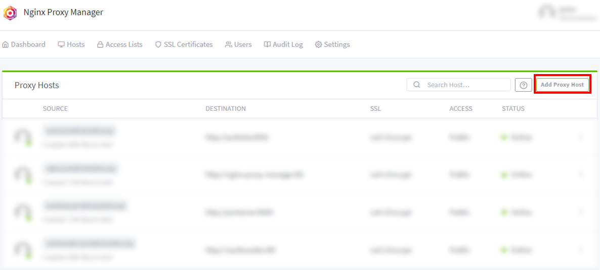
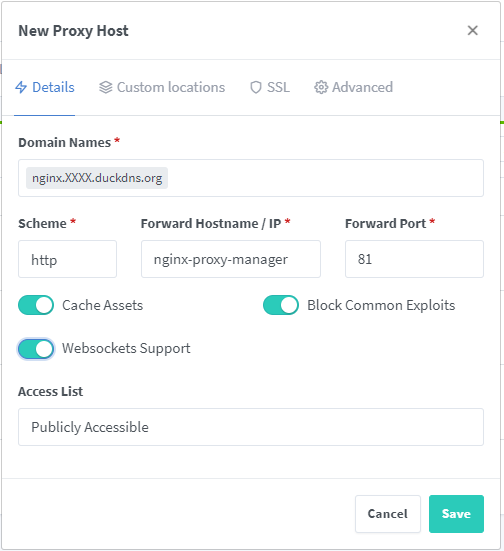
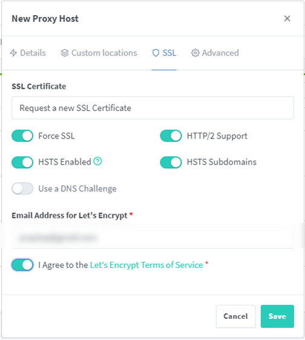

1. Proxy Host 등록을 위해 IP 대신 DDNS 적용
   - duckdns: <https://www.duckdns.org> 접속
   - Sign in with Goole -> 구글 계정을 통해서 Duck DNS 로그인
   - domains 란에 <span style="color: red"><원하는 이름></span> 입력
   - "success: domain <span style="color: red"><원하는 이름></span>.duckdns.org added to your account" 성공 메세지 확인
   - <span style="color: red"><원하는 이름> 오라클클라우드 공용 IP 주소 입력 -> update ip 버튼 클릭
   - "success: ip address for <span style="color: red"><원하는 이름></span>.duckdns.org updated to 공용IP주소" 성공 메세지 확인
   - ssh 접속 시 공용IP주소 대신 <span style="color: red"><원하는 이름></span>.duckdns.org 로 접속 가능.
2. 컨테이너 볼륨 디렉토리 생성
   - 도커 NPM 설치 경로 생성
     ```bash
     mkdir -pv ~/docker/npm_jc21/
     cd ~/docker/npm_jc21/
     ```
   - 볼륨 경로 생성
     ```bash
     mkdir -pv ./volume/data
     mkdir -pv ./volume/letsencrypt
     touch ./volume/config.json
     ```
3. docker-compose 작성

   ```bash
   cd ~/docker/npm_jc21/
   vim docker-compose.yml
   ```

   [docker-compose.yml](/docker/npm_jc21/docker-compose.yml)

   - PUID, PGID 란에는 컨테이너를 설치/사용할 user 계정의 UID, GID 숫자를 입력해야 한다.

4. docker container 실행
   ```bash
   sudo docker-compose up -d
   sudo docker-compose ps
   ```
5. admin panel 접속을 위해, 오라클 클라우드 인스턴스 81 포트 오픈
   - [메뉴] -> [컴퓨트] -> [인스턴스] -> "instance" 선택
   - 기본VNIC -> 서브넷 -> :"공용 서브넷-vcn" 선택 -> "Default Security List for vcn" 선택
   - [수신 규칙 추가]
     - 소스 CIDR: 0.0.0.0/0
     - 대상 포트 범위: 81
     - 설명: docker:nginx_jc21
   - [수신 규칙 추가]
6. NPM 관리페이지 접속 확인
   - START -> <span style="color: red">http://<원하는 이름>.duckdns.org:81</span> 관리 페이지 접속
   - 기본 아이디: admin@example.com
   - 기본 암호: changeme
   - Full Name, NickName, Email 정보 입력 -> [Save]
   - 기본암호: changeme 입력 -> New Password, Confirm Password 입력 -> [Save] -> 관리자 계정 등록 완료.
7. NPM 관리 페이지를 Proxy Host 등록

   - START -> NPM 관리페이지접속 -> [Dashboard] -> [Proxy Hosts] -> [Add Proxy Host]
     
   - [Details] 탭

     - Domain Names : <span style="color: red">nginx</span>.XXXX.duckdns.org
     - Scheme: <span style="color: red">"http"</span> 선택(기본값)
     - Foward Hostname /IP : "<span style="color: red">nginx-proxy-manager</span>"<span style="color: blue">(docker-compose.yml 의 nginx-prox-manager: 매칭)</span>
     - Foward Port: "<span style="color: red">81</span>"
     - Cash Assets: <span style="color: red">Check</span>
     - Block Common Exploits: <span style="color: red">Check</span>
     - Websockets Supports: <span style="color: red">Check</span><br>
       

   - [SSL] 탭  
      _ SSL Certificate: <span style="color: red">Request a new SSL Certificate</span> 선택
     _ Force SSL: <span style="color: red">Check</span>
     _ HTTP/2 Support: <span style="color: red">Check</span>
     _ HSTS Enabled: <span style="color: red">Check</span>
     _ HSTS Subdomains: <span style="color: red">Check</span>
     _ I Agree to the Let's Encrypt Terms of Service\*: <span style="color: red">Check</span>
     - [Save]<br>
       
       <br>
       > Prox Host 등록 후 https://nginx.XXXX.duckdns.org 접속 확인

8. admin panel 접속을 위해 오픈했던 81 포트 제거
   - START -> [메뉴] -> [컴퓨트] -> [인스턴스] -> "instance" 선택
   - 서브넷: "공용 서브넷-vcn" 선택 -> "Default Security List for vcn" 선택
   - 81 포트 삭제
