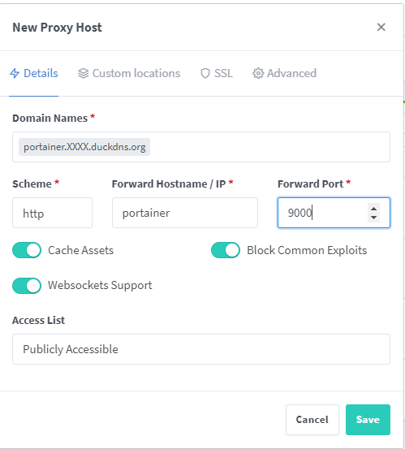
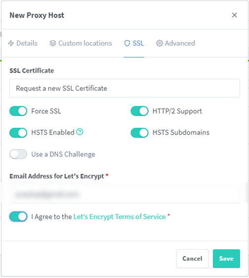
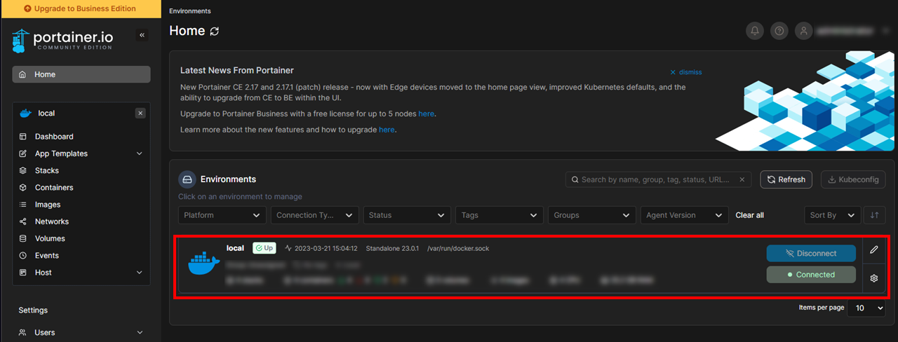
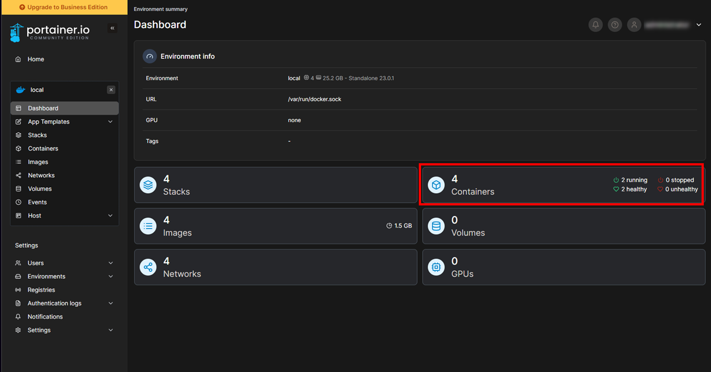
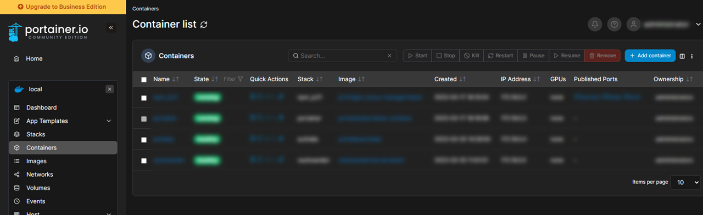

## Portainer 설치 및 Proxy Host 등록

### 1. 컨테이너 볼륨 디렉토리 생성

1. docker 설치 경로 생성
   ```bash
   mkdir -pv ~/docker/portainer/
   cd ~/docker/portainer/
   ```
2. 볼륨경로 생성
   ```bash
   mkdir -pv ./volume/data
   ```

### 2. docker compose 작성

```bash
cd ~/docker/portainer/
vim docker-compose.yml
```

[docker-compose.yml](/docker/portainer/docker-compose.yml)

> NPM 과 동일한 "nginx-proxy-manager" docker network를 사용할 경우 ports 에 포트 오픈을 명시할 필요가 없어 # 주석처리 함.<br>
> NPM 에서는 portainer service 이름으로 Proxy Host 연동이 가능하기 때문이다.

### 3. docker container 실행

```bash
sudo docker-compose up -d
sudo docker-compose ps
```

### 4. NPM 관리페이지 Proxy Host 등록

- START -> NPM 관리페이지 접속 -> [Dashboard] -> [Proxy Hosts] -> [Add Proxy Host]
- [Details] 탭
  - Domain Names: "<span style="color: red">portainer</span>.XXXX.duckdns.org" 입력
  - Scheme: "<span style="color: red">http</span>"
  - Forward Port: "<span style="color: red">9000</span>"
  - Cash Assets: <span style="color: red">Check</span>
  - Block Common Exploits: <span style="color: red">Check</span>
  - Websockets Supports: <span style="color: red">Check</span><br>
    <br/>
- [SSL] 탭
  - SSL Certificate: "Ruquest a new SSL Certificate" 선택
  - Force SSL: <span style="color: red">Check</span>
  - HTTP/2 Support: <span style="color: red">Check</span>
  - HSTS Enabled: <span style="color: red">Check</span>
  - HSTS Subdomains: <span style="color: red">Check</span>
  - I Agree to the Let's Encript Terms of Service: <span style="color: red">Check</span>
  - [Save]<br/>
    <br/>
    > Proxy Host 등록 후 -> https://portainer.XXXX.duckdns.org 접속 확인

### 5. Portainer 관리자 계정 등록

- START -> Portainer 설치 후 첫 접속시 -> 관리자 계정 등록 페이지 표시됨.
- 관리자계정 ID/PW 입력 -> [Create user]
- Home 메뉴 진입 -> local 선택
  <br/>
- Containers 선택
  <br/>
- Container list 확인
  <br/>
