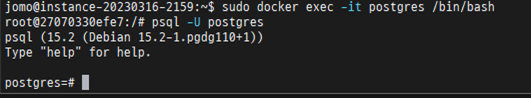
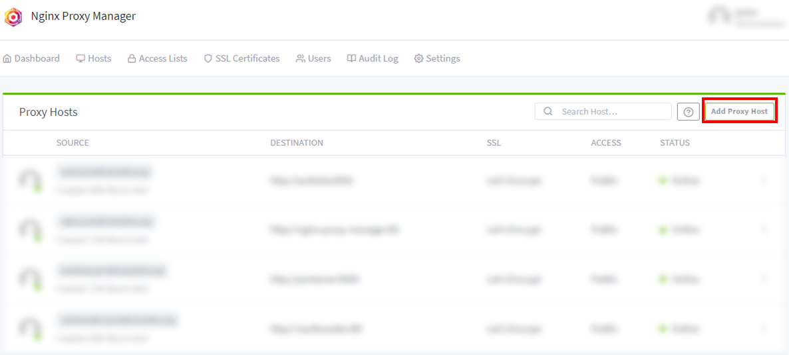
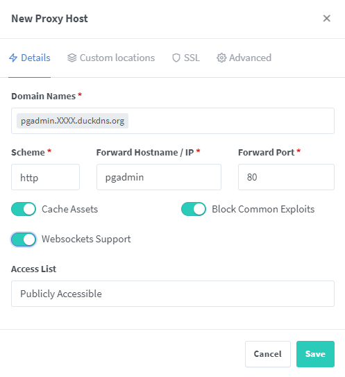

1. 컨테이너 볼륨 디렉토리 생성
   1. 도커 postgresql 설치 경로 생성
      ```bash
      mkdir -pv ~/docker/postgresql
      cd ~/docker/postgresql
      ```
   2. 볼륨 경로 생성
      ```bash
      mkdir -pv ./volume/data
      mkdir -pv ./volume/pgadmin/data
      ```
2. docker-compose 작성

   ```bash
   cd ~/docker/postgresql
   vim docker-compose.yml
   ```

   [docker-compose.yml](/docker/postgresql/docker-compose.yml)

3. docker container 실행
   ```bash
   sudo docker-compose up -d
   sudo docker-compose ps
   ```
4. postgresql 접속

   ```baash
   sudo docker exec -it /bin/bash
   psql -U postgres
   ```

   

5. NPM 관리페이지 Proxy Host 등록
   - START -> NPM 꽌리페이지 접속 -> [Dashboard] -> [Proxy Hosts] -> [Add Proxy Host]
     
   - [Details] 탭
     - Domain Names : <span style="color: red">pgadmin</span>.XXXX.duckdns.org
     - Scheme: <span style="color: red">"http"</span> 선택(기본값)
     - Foward Hostname /IP : "<span style="color: red">pgadmin</span>"<span style="color: blue">(docker-compose.yml 의 nginx-proxy-manager: 매칭)</span>
     - Foward Port: "<span style="color: red">80</span>"
     - Cash Assets: <span style="color: red">Check</span>
     - Block Common Exploits: <span style="color: red">Check</span>
     - Websockets Supports: <span style="color: red">Check</span><br>
       
   - [SSL] 탭
     - SSL Certificate: <span style="color: red">Request a new SSL Certificate</span> 선택
     - Force SSL: <span style="color: red">Check</span>
     - HTTP/2 Support: <span style="color: red">Check</span>
     - HSTS Enabled: <span style="color: red">Check</span>
     - HSTS Subdomains: <span style="color: red">Check</span>
     - I Agree to the Let's Encrypt Terms of Service\*: <span style="color: red">Check</span>
     - [Save]<br>
       
       <br>
       > Prox Host 등록 후 https://pgadmin.XXXX.duckdns.org 접속 확인
